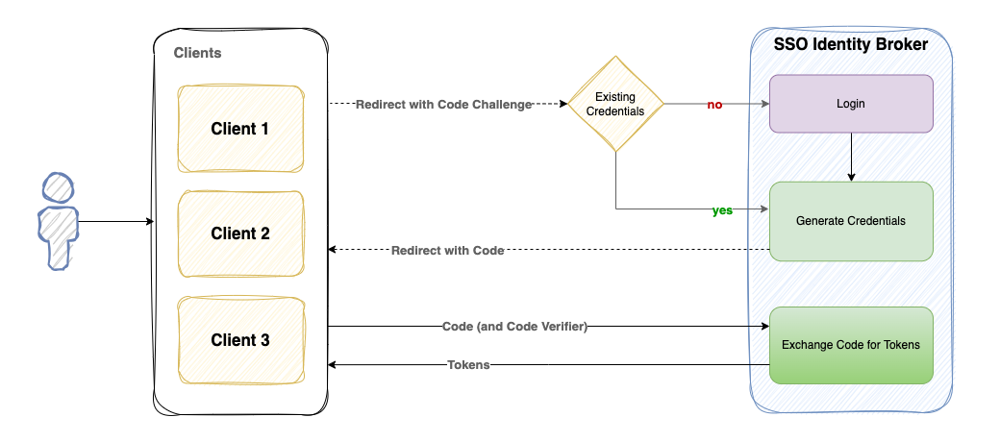

# Cognito Identity Broker example
This project illustrates how to use Cognito as an identity broker for multiple client applications. 
Using an identity broker simplifies client applications by removing the need to implement the entire authentication process.

In addition to simplifying and unifying the authentication process, this approach has the following benefits:
* Token validity length can vary by each client (hours, days, etc)
* Limit User attribute read/write permissions per client
* Pinpoint analytics per client
* Enabling advanced security per client

### The Identity Broker Authorization Code Flow Process



#### Prerequisites
* AWS Account
* Node v20.x
* Postman

---

### Setup
1. #### AWS Setup
  * Create AWS credentials that have the ability to deploy all resources in this stack.
    Typically you want a least privilege approach, but to simplify this example, create credentials with admin access so all resources can be created.
  * Create an AWS credentials *profile* in your local `~/.aws/credentials` file. 
    _Alternatively, use an existing profile with the `--profile` command line option during deploy_
      ```
      [deploy.dev]
      aws_access_key_id=xxxxxxxxxxxxxxxx
      aws_secret_access_key=yyyyyyyyyyyy
      ```
2. Run the following commands
 ```shell
  npm install
  npx sls deploy --region us-east-1
  ```

  - **Note:** _The cognito details will be output to the console when the deployment completes. Those details will also be stored in the file `.cognito-details.json` for your reference._ 
  
3. Create a user in your new User Pool
    ```shell
    npx sls invoke local --function createUser --data '{"name":"User", "email": "user@email.com", "password": "MyPassword1"}'
    ```
4. Setup Postman collection & environment
  * Import `postman/Cognito Identity.postman_collection.json`
  * Import `postman/Cognito Identity.postman_environment.json`
  * Set your Postman environment variables (info available in `.cognito-details.json` after deploy)
    * `apiUrl` - The base URL of your deployed API
    * `brokerClientId` - The Broker client ID
    * `clientId1` - Client 1 Id
    * `clientId2` - Client 2 Id
  * Turn off automatic redirects in postman. This will allow JSON responses on a GET method that returns a 302 redirect)
    * `Settings --> General --> Headers --> Automatically follow redirects`
---


# Using the Identity Broker
The _Authorization Code Flow_ process is broken into 3 main proceses:
* User logs in directly with the broker
* User's broker credentials are used to generate a code grant 
* User exchanges the code for tokens

### Run the full authentication flow
The postman collection has been setup to populate required variables (`code`, `refreshToken`) during the auth flow to eliminate the need to copy/paste values. 


1. Send the `Login` request. This will:
    * Return the broker credentials (`id, access, refresh` tokens)
    * Set the tokens in cookies on the broker's Api domain.
2. Send the `Start Client Auth Flow` request. This will:
    * Pass the user's broker credential cookies in the request.
    * Return a `code` for exchange.
3. Send the `Exchange Code for Tokens` request. This will:
    * Return the client credentials (`id, access, refresh` tokens)
4. Success! The user has been successfully authenticated with the client.
5. To refresh the client's credentials, send the `Refresh Client Tokens` request. This will:
    * Return refreshed `id` and `access` tokens.
  
 #### Code Challenges and Code Verifiers
 The postman collection has been setup with a paired challenge/verifer to simplify the example. If you would like to generate a new pair, use the following command:
 ```shell
 npx sls invoke local --function generateChallenge  
 ```

### Other things to explore
* **Use Client 2**.  - This client is configured w/tokens that are only valid for 1 hour. Client 1 tokens are valid for 2 hours.
* **Use an invalid `redirectUri` when starting the auth flow** -- this will result in an error
* **Use an invalid `codeChallenge` or `codeVerifier`** while initiating or exchanging a code for tokens.  -- this will result in an error
---


## API Methods

### Login - `POST /auth/login`

###### Body
```json
{ 
    "clientId": "{{brokerClientId}}", 
    "username": "user@email.com",
    "password": "MyPassword1"
}
```
###### Response
```json
{
    "requestId": "979b8012-a755-45ad-9cfe-43a51b0e3473",
    "requestStartTime": "2024-03-27T19:35:36.766Z",
    "requestEndTime": "2024-03-27T19:35:37.193Z",
    "success": true,
    "data": {
        "success": true,
        "result": "logged_in",
        "authentication": {
            "accessToken": "eyJraWQiOiIy...",
            "idToken": "eyJraWQiOiJ4Zz...",
            "refreshToken": "eyJjdHk...",
            "expiresIn": 3600,
            "tokenType": "Bearer"
        }
    }
}
```

This allows a user to login via the Broker's clientId. This is the only client that allows user login. Attempting to use consumer client's id will result in a login failure.


### Start Client Auth Flow - `GET /auth/client/authorize`
###### Querystring
```
?clientId={{clientId1}}&redirectUri={{redirectUriClient1}}&codeChallenge=xhrMObY-MOMInTN9GTR1HdzdQskQMJeU8CwxaTL0nA8`
```
* `clientId` - A consumer Client Id
* `redirectUri` - A redirectUri that is registered to the client in Cognito. (_configured in_: `serverless-cognito.yml`)
* `codeChallenge` - (_optional_) If provided, the `codeVerifier` must be used during the exchange of code for tokens.

###### Response
```json
{
    "requestId": "445fffcb-ec7a-4712-a129-b9e4980d46f1",
    "requestStartTime": "2024-03-27T19:35:53.257Z",
    "requestEndTime": "2024-03-27T19:35:54.568Z",
    "success": true,
    "data": {
        "success": true,
        "result": "code_flow_initiated",
        "code": "9039c5dc-c925-4407-9aea-5e857c9c4fd0",
        "redirectUri": "http://localhost:3001?code=9039c5dc-c925-4407-9aea-5e857c9c4fd0"
    }
}
```

This endpoint uses the `GET` method for browser redirect support (via a `302` HTTP status code and a `location` header with the `redirectUri` populated with the code grant). Additionally it will return a JSON response for non-web clients.

**Note**: _To get the JSON response in Postman, you have to turn off redirect following_: `Settings --> General --> Headers --> Automatically follow redirects`

### Exchange Code for Tokens - `POST /auth/client/token`

###### Body
```json
{
  "grantType": "authorization_code",
  "clientId": "{{clientId1}}",  
  "redirectUri": "{{redirectUriClient1}}",
  "code": "{{code}}",
  "codeVerifier":"utki3vQExiDuyXciGO1ww2mjJL3s0jWU5CNfUIa8rYiOACqVApLb1XPkLsIsrht5ekGYkAMCvEV6zWVKAenwfPgnFrTdRytsMaErKoZ8SU4Cs1gd1aASe2Z3oYAchARJ"
}
```
* `clientId` - A consumer Client Id
* `redirectUri` - The same redirectUri used when starting the auth flow process
* `code` - The code returned from starting the auth flow process
* `codeVerifier` - (_optional_) If `codeChallenge` was sent during the start of the auth flow process, this is required. 

###### Response
```json
{
    "requestId": "979b8012-a755-45ad-9cfe-43a51b0e3473",
    "requestStartTime": "2024-03-27T19:35:36.766Z",
    "requestEndTime": "2024-03-27T19:35:37.193Z",
    "success": true,
    "data": {
        "success": true,
        "result": "logged_in",
        "authentication": {
            "accessToken": "eyJraWQiOiIy...",
            "idToken": "eyJraWQiOiJ4Zz...",
            "refreshToken": "eyJjdHk...",
            "expiresIn": 3600,
            "tokenType": "Bearer"
        }
    }
}
```


### Refresh Client Tokens - `POST /auth/client/token`

###### Body
```json
{  
  "grantType": "refresh_token",
  "clientId": "{{clientId1}}",
  "refreshToken": "{{refreshToken}}"
}
```
* `clientId` - A consumer Client Id
* `refreshToken` - A valid/non-expired consumer client refresh token

##### Response
```json
{
    "requestId": "47a775d7-d8ca-48eb-9563-c662b5900407",
    "requestStartTime": "2024-03-27T19:36:47.044Z",
    "requestEndTime": "2024-03-27T19:36:47.261Z",
    "success": true,
    "data": {
        "success": true,
        "result": "refreshed",
        "authentication": {
            "accessToken": "eyJraWQiOiIyc1V...",
            "idToken": "eyJraWQiOiJ4ZzlHMVdlW...",
            "expiresIn": 7200,
            "tokenType": "Bearer"
        }
    }
}
```

This allows the consumer client application to request new `id` and `access` tokens from the broker. A new refresh token will not be returned. The only way to get a new refresh token is to use the `authorization_code` grant type.

---

#### Project Notes:
* This example uses a `username/password` approach for login. This is to keep this example focused on the broker concept. The preferred approach would be using **SRP** [(Secure Remote Password)](https://docs.aws.amazon.com/cognito/latest/developerguide/amazon-cognito-user-pools-authentication-flow.html#Using-SRP-password-verification-in-custom-authentication-flow).
* To remove the entire stack, run the following command:
  ```shell
  npx sls remove
  ```
